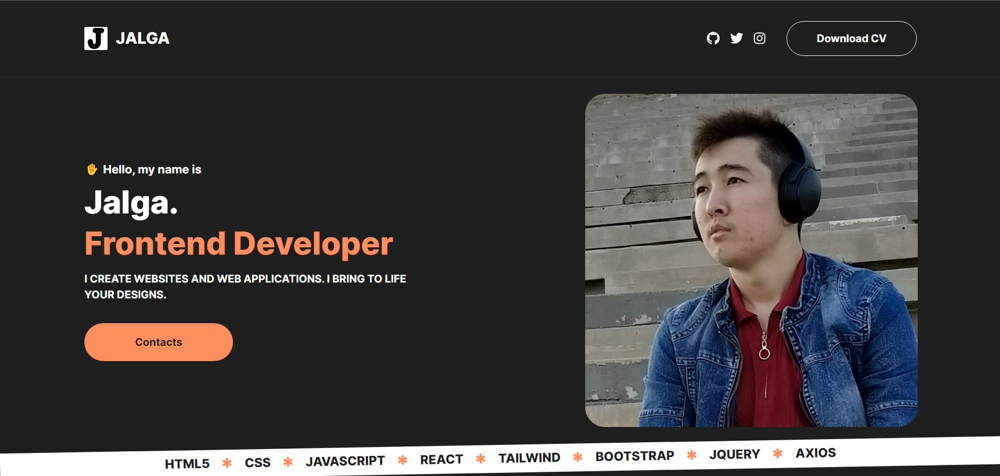

# Portfolio website

## Table of contents

- [Overview](#overview)
  - [The challenge](#the-challenge)
  - [Screenshot](#screenshot)
  - [Links](#links)
- [My process](#my-process)
  - [Built with](#built-with)
  - [What I learned](#what-i-learned)
  - [Continued development](#continued-development)
  - [Useful resources](#useful-resources)
- [Author](#author)
- [Acknowledgments](#acknowledgments)

## Overview

### The challenge

Users should be able to:

- View the optimal layout depending on their device's screen size
- See hover states for interactive elements

- Get introductory info about me.
- See a list of my skills.
- Check my completed portfolio projects.
- Contact me via email.
- Check my Github, Twitter, Instagram accounts.

### Screenshot

<p float="left">
  
</p>

### Links

- Repository URL: [Add solution URL here](hhttps://github.com/coder-96/to-do-list-django-fbv)

## My process

### Built with

Frontend:
- React JS
- HTML5
- CSS3
- Flexbox
- CSS Grid
- Tailwind CSS

### What I learned

Improved my frontend skills once again, and gained more knowledge overall on Responsive Design, React JS.

```javascript react
import { FontAwesomeIcon } from '@fortawesome/react-fontawesome';
import letter_j from "../images/letter-j.png";
<a href="https://github.com/coder-96"><FontAwesomeIcon icon={ faGithub } size="lg" /></a>
```

```css
    .projects > ul {
        display: grid;
        grid-template: repeat(3, minmax(240px, 1fr)) / repeat(3, minmax(240px, 1fr));
        gap: 4em;
    }

    .projects > ul > li {
        border-radius: 15px;
    }

    @media (max-width: 1000px) {
        .projects > ul {
            grid-template-columns: repeat(auto-fit, minmax(240px, 1fr));
            grid-template-rows: none;
            /* grid-template: repeat(auto-fit, minmax(240px, 1fr)) / repeat(auto-fit, minmax(240px, 1fr)); */
        }
    }

```

### Continued development

I'm focused on perfecting my Full Stack skills by building more projects.

### Useful resources

- [MDN Web Docs](https://developer.mozilla.org/en-US/) - helped me find answers when I got stuck.

## Author

- Website - [Jalga](https://github.com/coder-96)

## Acknowledgments

I thank my family for supporting me on my way to becoming a Developer. 